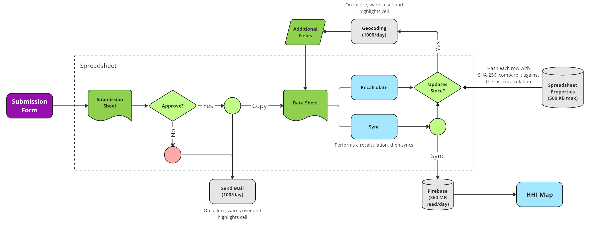

# HHI Map AppScript
### https://hhi-map.netlify.app/

AppScript code for the HHI Map's Stakeholder Submission Form.



# How Does This Work?

### Submission Sheet and Handling Responses
Submissions will fall under the "Submission" sheet. There, submissions can be approved or rejected based on the information present.
 
On approval/rejection, an email can optionally be sent to the Email Address that submitted the form. This email is composed of the appropriate email configuration in the "Settings" sheet. 
### Data Sheet and Recalculation, Synchronization
On approval, a copy of submission information (excluding the Timestamp and Email Address) is pasted in the "Data" Sheet. 

The "Data" Sheet represents the format of data copied to the database."

Each submission has a few fields that must be calculated from prior entries. This notably includes geocoding. Pressing the "Recalculate" button in the "Settings" Sheet will automatically calculate any rows that have been updated since its last calculation (or perform one if there hasn't been one).

The "Data" Sheet must also be synchronized to the database itself. Pressing the "Sync" button in the "Settings" Sheet will attempt recalculation if necessary, then synchronize all rows to the database.
### Error Handling
If there exists an error in processing, one of the cells for the values will be highlighted, and a note will appear on the cell explaining the reason. A notification will be sent to the email denoted as the administrator in the "Settings" Sheet.

### Links

Parent project: https://github.com/DSSD-Madison/HHI

Spreadsheet: https://docs.google.com/spreadsheets/d/1112geWi_64-1Eev9PLxqnUHLi3GzXamSOxBqwyqyriM/edit?pli=1#gid=1202430194

### Local Development
This project follows [this guide on AppScript](https://developers.google.com/apps-script/guides/typescript) to enable TypeScript development on AppScript.

It also follows [the instructions from the Github](https://github.com/google/clasp/blob/master/docs/typescript.md), which leads to [this page](https://github.com/google/clasp/blob/master/docs/esmodules.md) and [this repo](https://github.com/atti187/esmodules/blob/main/babel.config.js), in order to support ES modules syntax (import/export)

This project requires node, npm, and clasp.

To install clasp, run:
```
npm install -d @google/clasp
```

To set up the project to sync, run the following at the root of this project:
```
npm i
npm run build
clasp login
clasp push --watch
```

### Configuration

Spreadsheet specific constants are located in the following:
- `.clasp.json` -> The App Script id. From the sheet, navigate to Extensions > App Script. On the left hand side, select Project Settings. The Script ID should be a unique identifier
- `constants.ts` -> Contains the constants `SPREADSHEET_ID`, `SUBMISSION_SHEET_ID`, `DATA_SHEET_ID`, `SETTING_SHEET_ID` to configure for a spreadsheet

See `index.ts` for all of the latest triggers.

There currently exists three triggers:
- `onEditCustom` -> From the sheet, navigate to Extensions > Apps Script. On the top bar, select the `resetTriggers` function and run it. This will create the onEditCustom trigger and delete any existing triggers.
- `onRecalculateButtonClick` -> Create a Google Drawing for a recalculate button to trigger this 
- `onSyncButtonClick` -> Create a Google Drawing for a sync button to trigger this 